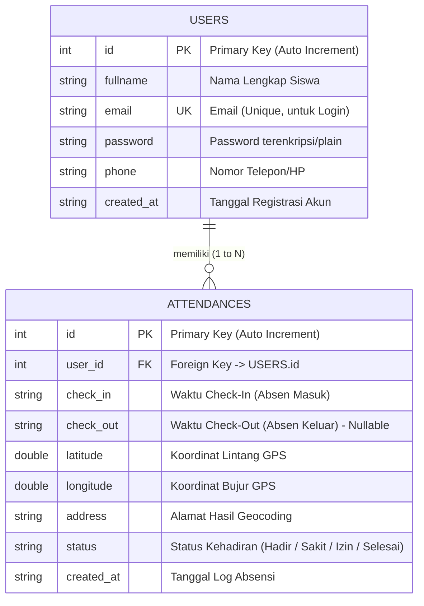
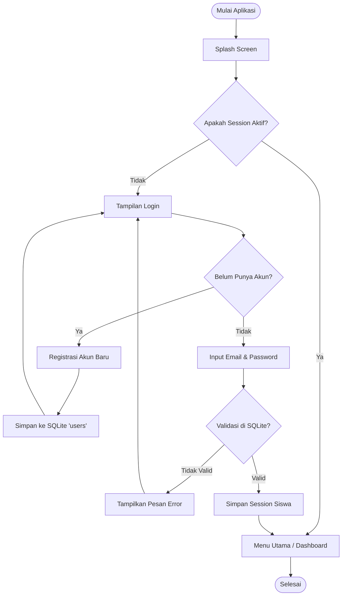
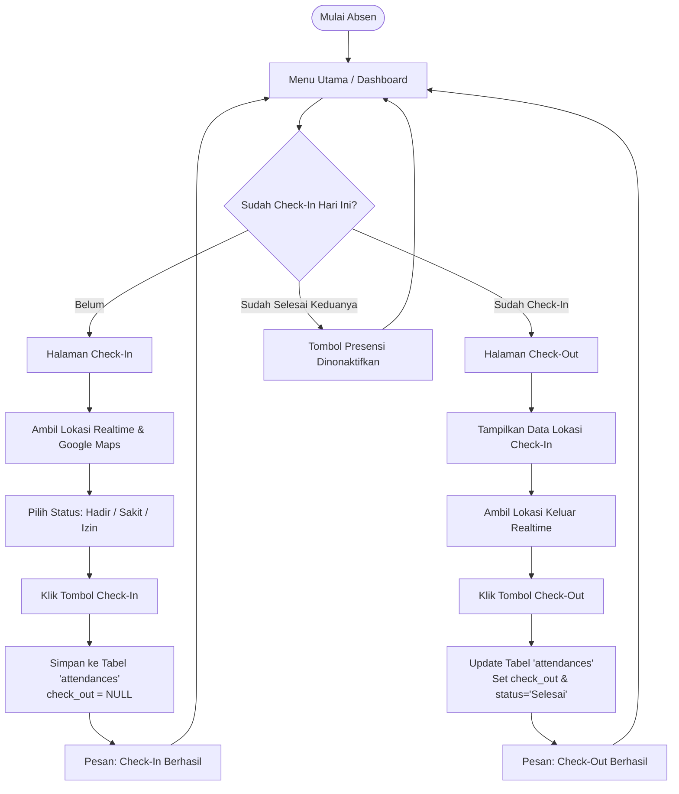
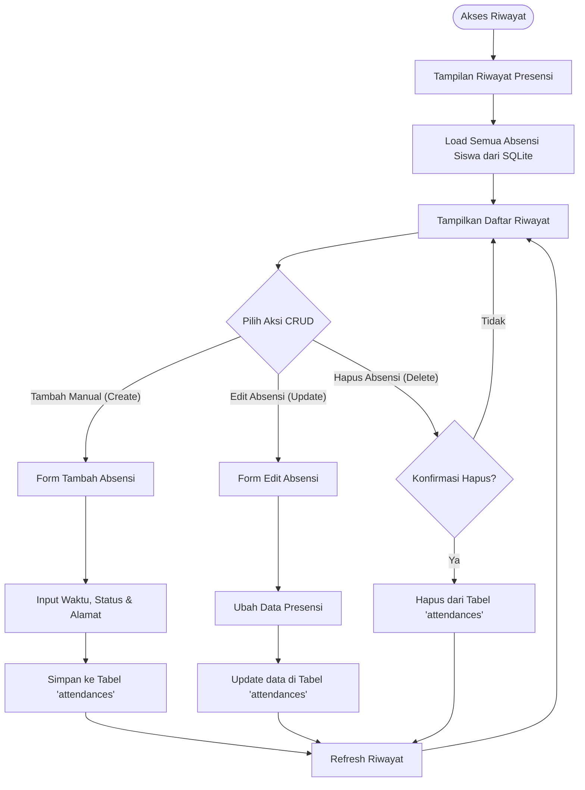
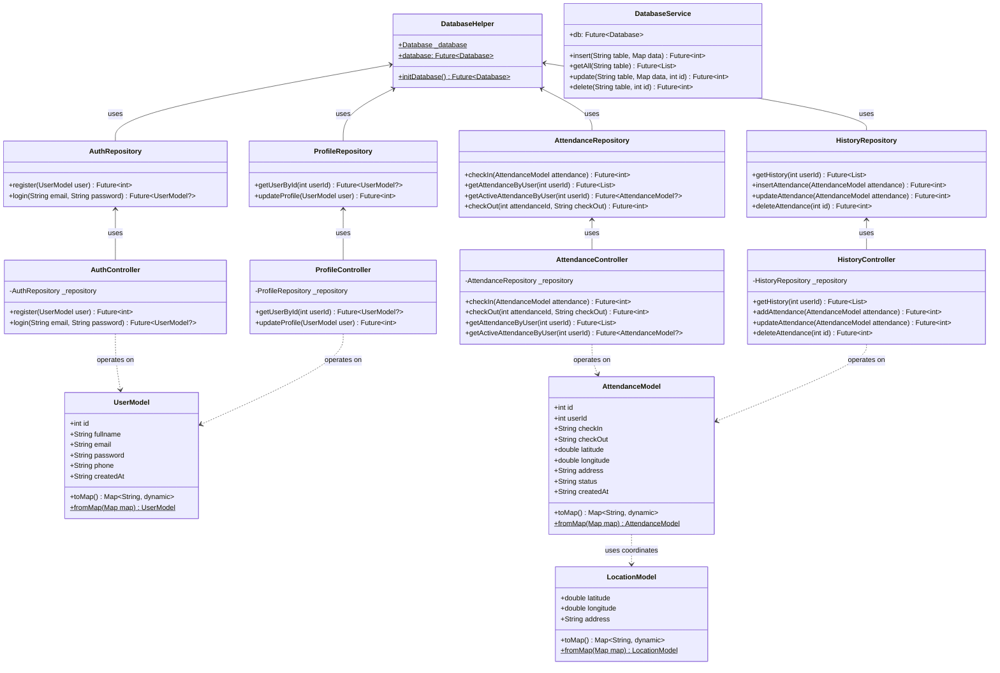

# Dokumentasi Diagram Sistem - Jejak Hadir SMK

Dokumen ini berisi visualisasi arsitektur dan alur kerja aplikasi **Jejak Hadir SMK** (Sistem Absensi/Presensi Siswa SMK). Visualisasi disajikan dalam 3 bentuk utama:
1. **Entity Relationship Diagram (ERD)** — Struktur dan hubungan data database.
2. **Flowchart (Alur Kerja)** — Alur proses utama (Login, Absensi, CRUD Riwayat).
3. **Class Diagram** — Struktur kode, class, method, property, dan hubungannya.

---

## 1. Entity Relationship Diagram (ERD)

ERD ini menunjukkan struktur penyimpanan database lokal menggunakan **SQLite** (`attendance.db`). Terdapat dua entitas utama yaitu **Users** (menyimpan data siswa) dan **Attendances** (menyimpan data riwayat presensi/absensi).

### Penjelasan Detail Hubungan ERD:
* **USERS (Siswa)**: Berfungsi untuk menyimpan informasi profil siswa SMK. Setiap siswa didefinisikan dengan atribut unik seperti `email` untuk otentikasi login.
* **ATTENDANCES (Presensi)**: Menyimpan detail presensi harian siswa yang mencakup koordinat lokasi geografis (`latitude` & `longitude`), alamat lengkap (`address`), serta waktu masuk (`check_in`) dan keluar (`check_out`). Atribut `status` membedakan jenis presensi seperti "Hadir", "Sakit", "Izin", atau "Selesai" (setelah check-out).
* **Kardinalitas**: Hubungan **1-to-N** (One-to-Many). Satu orang Siswa (`USERS`) dapat memiliki banyak catatan presensi harian (`ATTENDANCES`), tetapi setiap baris data presensi hanya dimiliki oleh tepat satu Siswa.

---

## 2. Flowchart (Alur Kerja Sistem)

Alur kerja aplikasi presensi Jejak Hadir SMK terbagi menjadi beberapa proses utama: Alur Autentikasi (Login/Register), Alur Melakukan Presensi (Check-in/Check-out), dan Alur Manajemen Riwayat (CRUD).

### A. Alur Autentikasi & Masuk Aplikasi

### B. Alur Presensi Siswa (Check-In & Check-Out)

### C. Alur Manajemen Riwayat Absensi (Fitur CRUD)

---

## 3. Class Diagram

Class diagram ini menggambarkan struktur arsitektur berorientasi objek yang diterapkan pada aplikasi Jejak Hadir SMK dengan memisahkan tanggung jawab menggunakan arsitektur berlapis (Layered Architecture): **View/Screen**, **Controller**, **Repository**, dan **Model**.

### Penjelasan Komponen Class Diagram:
1. **Model Layer (`UserModel`, `AttendanceModel`, `LocationModel`)**:
   * Class representasi data (POJO/Dart data class) untuk memetakan objek dari/ke database SQLite.
2. **Repository Layer (`AuthRepository`, `AttendanceRepository`, dll.)**:
   * Bertanggung jawab melakukan interaksi SQL mentah (`query`, `insert`, `update`, `delete`) ke database SQLite via `DatabaseHelper`.
3. **Controller Layer (`AuthController`, `AttendanceController`, dll.)**:
   * Bertindak sebagai pengatur logika bisnis (*business logic layer*). Menghubungkan UI/Screen dengan data di Repository.
4. **Helper Layer (`DatabaseHelper`, `DatabaseService`)**:
   * Mengatur inisialisasi koneksi database SQLite (`openDatabase`), pembuatan tabel, dan operasi database tingkat rendah.
